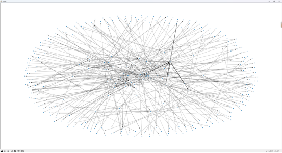
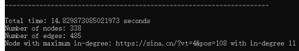
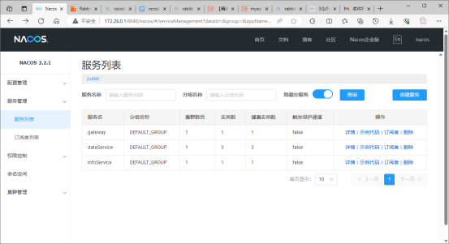
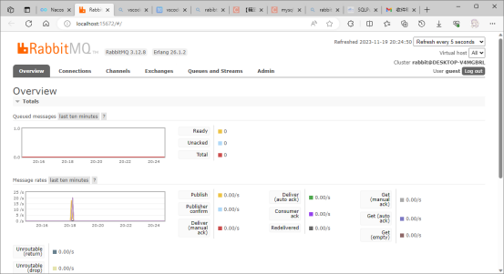
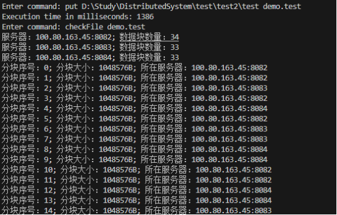
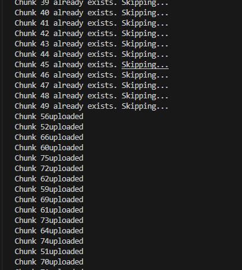
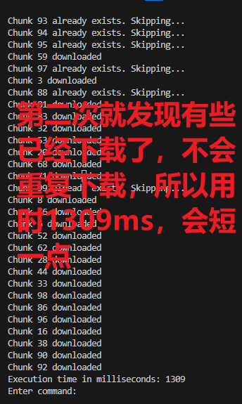

  

 🥕 

 如果兔兔的仓库对你有帮助的话点个⭐喵~ 

 If Tutu's repository is helpful to you, please give it a ⭐ meow~ 

 もしうさぎのリポジトリが役に立った場合は、⭐をぽちっとしてくださいにゃん~  

 🍉 

 任何 ❓问题/💭思考/💡想法 都欢迎提出！

 Any ❓question/💭thought/💡idea  is welcome! 

 どんな ❓質問/💭考え/💡アイデア でも歓迎です！ 

# 简介

本仓库为同济大学软件学院2023秋季学期分布式编程作业2：网络编程

作业要求 & 作业笔记 & 其他事项见链接：🔗 [Review](https://momoyamasawa.notion.site/2-1818c990312248ed880f05a23a7baead?pvs=4)

