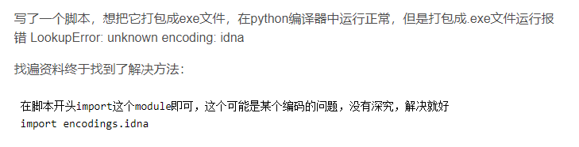

不知道为什么python打包编译这个总是遇到意想不到的问题，比如我在py编译器下直接运行脚本可以运行的，结果打包出来的exe的numpy包老是报错，查是版本问题，然后改了之后功能也很奇怪（会出现unknown encoding: idna 等的问题），总之是打包出来的exe跑不正常，虽然有解决方案，见下图，但是懒得搞了，就录了视频（python这种天生开源的语言打包成exe真的蠢，bug一大堆）

